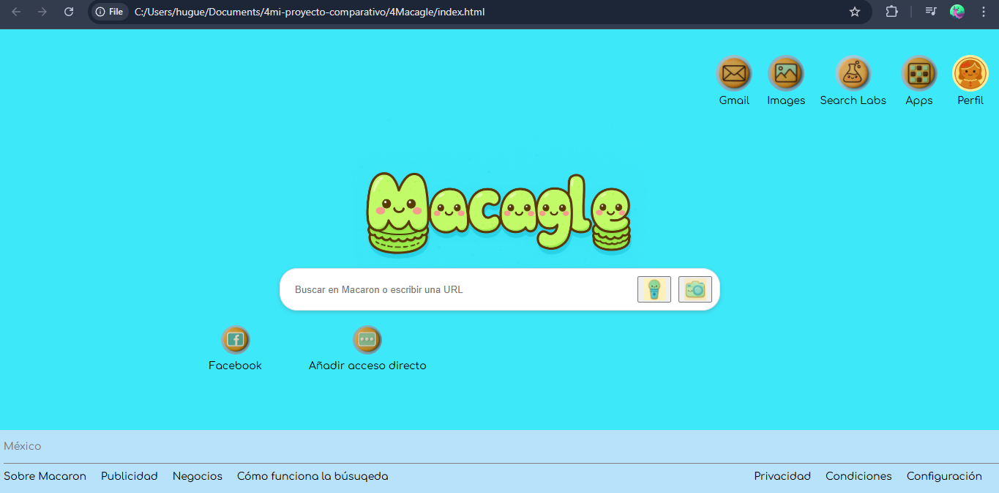

# 🌟 Mi Proyecto "Macagle" vs. el Clon de Google del Profesor 🌟
Este repositorio contiene una comparación de dos proyectos: un clon de la página principal de Google que desarrollé por mi cuenta ("Macagle") y otro que creé siguiendo las instrucciones de mi profesor.

El objetivo del repositorio es mostrar mi proceso de aprendizaje, mis habilidades de diseño y las diferencias de las metodologías de maquetación entre un proyecto autodidacta y uno más profesional.

## 🚀 Proyecto 1: Macagle - El Buscador Kawaii (Mi método)
**Descripción:** Una imitación de la página de Google con un diseño de estilo "kawaii" con colores amigables. Este proyecto es mi primer intento de replicar un sitio web real. La funcionalidad es idéntica a un buscador básico, pero resalté la creatividad aplicando mis conocimientos de diseño UX.

* **Decisiones clave:**

* Diseño: Elegí una paleta de colores vibrantes menta y una tipografía más redonda y amigable (Comfortaa) para darle una identidad juguetona.

* Maquetación: Utilicé HTML y CSS para replicar la estructura, aunque a veces me iba por caminos muy rebuscados y me repetía en el código, asignando clases a elementos que no siempre lo necesitaban.

## 💻 Proyecto 2: Clon de Google (Método del Profesor)
Descripción: Aquí seguí las instrucciones de mi profesor. Su objetivo era enseñar un método más limpio y profesional para la maquetación.

* **Aprendizajes clave:**

* Eficiencia: El código es más pulcro, pues utiliza de una manera más eficiente las clases y las propiedades de CSS.

* Simplicidad: Aprendí a usar selectores de forma más inteligente lo que me ayudó a evitar la necesidad de clases extra en cada elemento. Por ejemplo, entendí qué _justify-content: space-between_ puede resolver problemas de espaciado sin la necesidad de envolver todo en divs adicionales.

## 🔍 Análisis y Conclusiones
Comparar ambos proyectos fue una experiencia muy valiosa que me ayudó a entender los problemas de maquetación de una manera más empírica y a desarrollar mi propia lógica. También, me enseñó a refinar esa lógica, a escribir código más profesional y a discernir cuándo es realmente necesaria una clase o un contenedor extra.

Este ejercicio me ha demostrado que el aprendizaje no solo se trata de copiar o aplicar ciegamente una instruccion solo porque así la aprendiste, sino de entender el "por qué" detrás de cada decisión de código. Ahora puedo aplicar un ojo más crítico a mi propio trabajo y buscar siempre la solución más simple y elegante, DRY.
